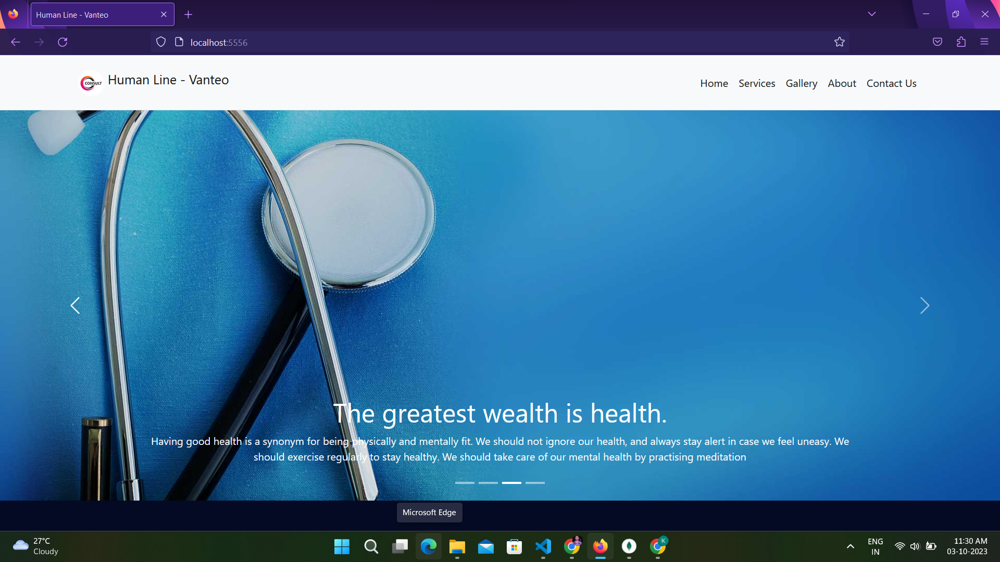
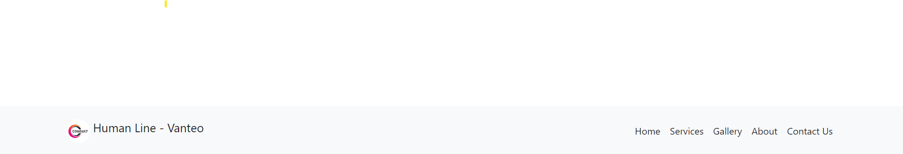

# Human_Line-Vanteo

# Dynamic Website Project



This is a dynamic website project featuring a responsive design with the following components:

- Navbar
- Sliders
- Banners
- Contact Us Form
- Services Section
- Footer

## Table of Contents

- [Project Overview](#project-overview)
- [Features](#features)
- [Screenshots](#screenshots)
- [Getting Started](#getting-started)
- [Usage](#usage)
- [Contributing](#contributing)
- [License](#license)

## Project Overview

This dynamic website project is designed to showcase a modern and responsive website layout. It includes various sections such as a navigation bar, sliders, banners, a contact form, a services section, and a footer.

## Features

- **Navbar:** A navigation bar for easy navigation across the website.

- **Sliders:** Engaging sliders to display featured content or images.

- **Banners:** Three prominent banners to highlight key information or promotions.

- **Contact Us Form:** A user-friendly contact form to capture user inquiries.

- **Services Section:** A section to showcase the services your website offers.

- **Footer:** A footer section with essential links and information.

## Screenshots



*Navbar*


*Sliders*


*Banners*


*Contact Us Form*


*Services Section*


*Footer*

## Getting Started

To get started with this project, follow these steps:

1. Clone this repository to your local machine:

   ```shell
   git clone https://github.com/Khirasagar/Human_line-Vanteo.git
Open the project in your preferred code editor.

Customize the website content and styles to fit your needs.

Usage
Start a local development server to preview the website:

shell
Copy code
npm install # or yarn install
npm start   # or yarn start
Open your web browser and visit http://localhost:3000 to see the website in action.

Make any necessary adjustments to the code, and the changes will be reflected live.

Contributing
If you'd like to contribute to this project, please follow our Contributing Guidelines.

License
This project is licensed under the MIT License.
